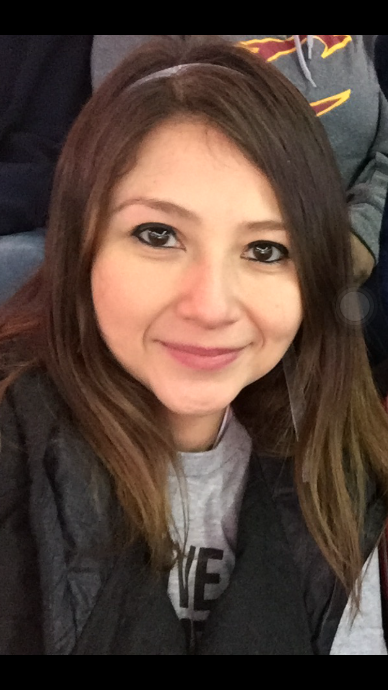
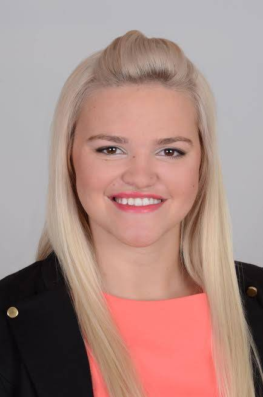
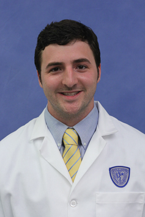

# Teaching Assistants

The teaching assistants for 431 this year are Claudia Cabrera, Omar Alaber, Rosie Conic, Bob Winkelman and Terry Cui. They are the people answering 431-help at case dot edu, and they are the people holding the bulk of our office hours. Most of them has been in your shoes - they've taken the course in the past, and they enjoyed it enough to come back for more. Many have volunteered their precious time and energy to help make the course happen, and we couldn't be more delighted to welcome you to the course.

To contact the TAs, email `431-help at case dot edu`.

## Office Hours for TAs

Teaching Assistant Office Hours are held in WG-56 (Computing Lab) or WG-67 (Student Lounge) on the ground floor of the Wood building, so be sure to look in both places if you need help. 

## Claudia Cabrera

```{r Claudia-fig, echo = FALSE, out.width = '33%'}

```

Claudia Cabrera, MD, graduated from Monterrey Institute of Technology and Higher Education Medical School in 2012 and is in the Masters' Program in Clinical Research. Before coming to Case, Claudia worked in Bariatric Surgery for two years while also lecturing in Anatomy and Physiology at the same university from which she graduated in Mexico. She took 431 and 432 two years ago and thoroughly enjoyed learning Statistics, especially its applications to medicine. Claudia loves doing Clinical Research as well as learning and teaching. Currently her research is related to melanoma and head and neck surgery. In her free time, Claudia loves playing basketball, and reading. Claudia is the Lead TA for 431, Section 1, but all TAs work with both sections. 

## Omar Alaber

```{r Omar-fig, echo = FALSE, out.width = '33%'}
knitr::include_graphics("figures/Omar.jpg")
```

Omar Alaber, MD, is a 2008 international medical graduate from Al Mergib University, Faculty of Medicine. He is in his second year in the Clinical Research Masters' Program (CRSP). Before he came to the USA in 2014, he was working in Internal Medicine Department as senior house officer (a resident) for about 5 years. Also, he served as a teaching assistant in the Internal Medicine department. Omar's current research focuses on capsule endoscopy, but he is also planning new projects in advanced endoscopy. In his free time, Omar loves spending time with his wonderful wife and two adorable daughters travelling, grilling, or just chatting. Also, he likes playing soccer. Omar is the Lead TA for 431, Section 2, but all TAs work with both sections.

## Ruzica (Rosie) Conic

```{r Rosie-fig, echo = FALSE, out.width = '33%'}

```

Ruzica (Rosie) Conic, MD, graduated from Belgrade University School of Medicine in 2015. She is beginning her 3rd year in the Clinical Translational Science PhD. Rosie's research interests are in dermatology (specifically psoriasis, melanoma and hair loss) and utilization of EHRs and large databases for dermatology research. She is also the head of professional development of Women in Sciences and Humanities Earning Doctorates (WISHED) here at CWRU, community of female doctoral students and candidates that aims to provide social and professional resources and tools for individual and collective development. If you're interested in WISHED, let her know! In her free time she likes to play sports.

## Bob Winkelman

```{r Bob-fig, echo = FALSE, out.width = '33%'}

```

Bob Winkelman is a third year student in the MD program at the CWRU School of Medicine. He received his undergraduate degree from Carnegie Mellon University where he majored in Chemical and Biomedical Engineering.  Before coming to CWRU for medical school, Bob also spent 1 year working for Epic, an electronic health record vendor, in Wisconsin. Bob took 431 and 432 last year and has appreciated how the skills he learned in those classes have helped him with his clinical outcomes research at Cleveland Clinic Center for Spine Health.  Bob enjoys playing flag football, exercising, cooking, reading, and listening to podcasts. 

## Zuxi (Terry) Cui

Terry Cui is a PhD student in the Department of Population and Quantitative Health Sciences.
