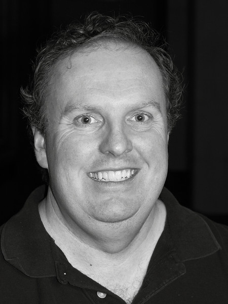
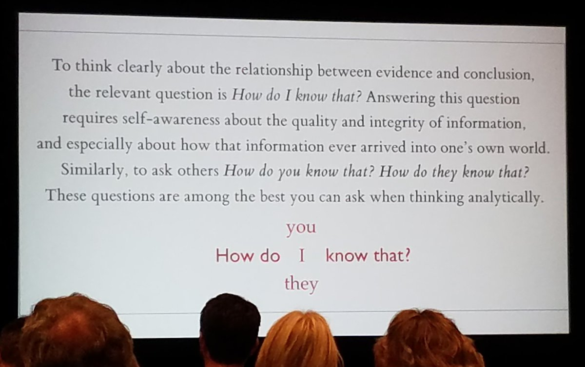

# Key Information {-}

This is the Spring 2018 syllabus page for PQHS / CRSP / MPHP 432: Data Science for Biological, Medical and Health Research II, taught by Professor Thomas E. Love. The course is given on Tuesdays and Thursdays from 1:00 to 2:15 PM, in Room E321-323 in the School of Medicine.

## Course Home Page {-}

The course home page, with links to everything else you'll need, is at https://github.com/THOMASELOVE/432-2018. 

## Getting Help! {-}

To get help for anything related to the course, email the Teaching Assistants and Dr. Love at `431 dot help at case dot edu`.

- Dr. Love is available on Tuesdays and Thursdays at CWRU, by appointment. To make an appointment, email him directly at `thomas dot love at case dot edu`. His office is Wood WG-82 L.
- If you have any special concerns about the course, need special accommodations or any other issues for Dr. Love, please email him, or speak with him before or after class.

<!--chapter:end:index.Rmd-->

# Course Description

PQHS 432 (cross-listed as, for example, CRSP 432 and MPHP 432, and formerly known as EPBI 432) is the second half of a two-semester sequence (with PQHS 431) focused on modern data analysis and advanced statistical modeling, with a practical bent (as little theory as possible), emphasizing the key role of thinking hard, and well, about design and analysis in research. The title listed by the registrar is a little dated - I prefer *Data Science for Biological, Medical or Health Research*.

This is a good course for people who want to learn how to use the R language to get information from data, and who want to learn about making comparisons and building models to help make meaningful progress in research, focusing on questions from biology, medicine and public health. We spend time managing and visualizing data, building models and making predictions, and other things thought of as "data science" - in essence, this highly applied course focuses on modern, more than classical, tools for learning from data. The course is taught using the R statistical software and RStudio environments, with the material discussed in 431 assumed in 432. Students learned a lot of R in the 431 course, and that material remains available at https://github.com/THOMASELOVE/431. We'll continue to use R Studio and R Markdown as tools to help make R work better, and perform our research in replicable ways.

## General Approach / Topics

The course covers the following general topics, roughly in this order, through early April. Additional topics (for the remainder of April) will be determined later in the semester.

1. Linear Regression (including weighted and robust approaches, variable selection, dealing with missing data, fitting non-linear relationships through predictor transformation, cross-validation approaches, and multi-factor ANOVA and ANCOVA)
2. Logistic Regression (including both models for binary outcomes, and models for proportions, and risk adjustment)
3. Generalized Linear Models (including regression models for count data, multi-categorical outcomes)
4. The Statistical Crisis in Science
5. Cluster Analysis (mostly in the form of Principal Components Analysis)
6. Survival Analysis (Kaplan-Meier curves and Cox Regression)

A more detailed and up-to-date plan is contained on the [Topics page for the course](https://github.com/THOMASELOVE/432-2018/blob/master/TOPICS.md).

## Prerequisites

Taking 432 without 431 is not recommended. The pace can be brisk at times, but all CWRU students who feel up to it are welcome, in any field of study. 

The main things students need for 432 are:

- tools: substantive knowledge of the use of R, R Studio and R Markdown to produce code which will ingest, visualize, explore, analyze and model data, then communicate the results
- statistical methodology: substantiave understanding of statistical inference in the one-, two- and multi-sample cases and the fundamentals of linear regression models, including the building of multiple linear regressions, and their evaluation through diagnostic plots, stepwise model selection, assessment of uncertainty via confidence and prediction intervals, and basic in-sample and out-of sample validation summaries
- data to study related to biological, health and/or medical phenomena, and 
- an interest in studying data closely and presenting rigorous analyses effectively

Some of these topics are reviewed in early 432 sessions.

## Everything is on the Web

https://github.com/THOMASELOVE/432-2018 is the place to go for everything related to this course. Please visit any time you need something. I update the web site frequently. You'll find links there related to:

- Your homework **Assignments**
- **Data and Code** I will provide
- my in-class presentation **Slides**
- instructions and hints related to the **Projects**
- various outside **Texts**
- a detailed **Schedule** of classes and deadlines
- details on the **Quizzes**

<!--chapter:end:01_description.Rmd-->

# Dr. Love

Thomas E. Love, Ph.D.

- Professor of Medicine, Population and Quantitative Health Sciences, [CWRU](http://case.edu/)
- Director of [Biostatistics and Evaluation](http://chrp.org/biostatistics-evaluation/), [Center for Health Care Research & Policy](http://chrp.org/), [MetroHealth Medical Center](https://www.metrohealth.org/research)
- [Chief Data Scientist](http://www.betterhealthpartnership.org/data_center/), [Better Health Partnership](http://betterhealthpartnership.org/)
- Track Lead for Health Care Analytics, MS in Biostatistics, [Department of Population and Quantitative Health Sciences](http://epbiwww.case.edu/), CWRU
- Fellow, [American Statistical Association](http://www.amstat.org/)

## Email

- Email to get help with the course: **431-help at case dot edu** (seen by Professor Love and the TAs)
- Thomas dot Love at case dot edu (for matters related to grades or individual concerns)
- Dr. Love is hard to reach by phone. Email is always the best way to reach him.

## Offices

- Wood WG-82L on the ground floor of the Wood building (Tuesdays and Thursdays)
- Rammelkamp R-229A at MetroHealth Medical Center (Wednesdays and Fridays)

Dr. Love is generally available for a few minutes before and 30 minutes after class, otherwise by appointment on Tuesdays and Thursdays (send him an email to schedule an appointment.) 

## Web 

- [Web site for this course](https://github.com/thomaselove/432-2018)
- Dr. Love's GitHub name is [THOMASELOVE](https://github.com/thomaselove).
- His Twitter handle is @[ThomasELove](https://twitter.com/ThomasELove)

## A More Complete Biography

Hi. I have at least three different jobs.

- I am a Professor in the Departments of Medicine and Population & Quantitative Health Sciences at Case Western Reserve University. I teach three courses per year there (PQHS [431](https://github.com/THOMASELOVE/431), [432](https://github.com/THOMASELOVE/432-2018) and [500](https://github.com/THOMASELOVE/500-2018)) and also lead the Health Care Analytics track of the MS program in Biostatistics.
- I direct [Biostatistics and Evaluation](http://chrp.org/biostatistics-evaluation/) at the [Center for Health Care Research & Policy](http://chrp.org/), which is a joint venture of CWRU and MetroHealth Medical Center.
- For ten years, I was the (founding) Data Director for [Better Health Partnership](http://betterhealthpartnership.org/), an alliance of people who provide, pay for and receive care in Northeast Ohio. I now serve as Chief Data Scientist there.
- I am a Fellow of the American Statistical Association, and have won some awards for my teaching and my research. 
- I have been teaching at CWRU since 1994, and have taught every type of CWRU student over the years, especially graduate students in biostatistics, medicine, and management.

In research, I use statistical methods to look at questions in health policy and in particular the provision of health services. I mostly work with observational data, rather than data that emerge from randomized clinical trials, and I have a special interest in working with data from electronic health records.

- You may be interested in a [study in Health Affairs](http://content.healthaffairs.org/content/34/7/1121.abstract) showing the impact of a [Medicaid-like expansion plan on care and outcomes of poor patients in Cleveland](http://thedaily.case.edu/new-study-shows-prepared-safety-net-improves-care-saves-money-in-medicaid-expansion-population/).
- Or you might be interested in our [New England Journal of Medicine study](http://www.nejm.org/doi/full/10.1056/NEJMsa1102519) of the effect of electronic health records on the care and outcomes of people with diabetes.
- In 2011, [James O'Malley](http://tdi.dartmouth.edu/faculty/a-james-omalley-phd) and I chaired the [Ninth International Conference on Health Policy Statistics](https://ww2.amstat.org/meetings/ichps/2011/index.cfm?fuseaction=main), here in Cleveland. Here's a [recap](https://link.springer.com/article/10.1007%2Fs10742-012-0096-8). We may chair it again in 2021.
- I've also worked on many projects involving the use of propensity scores to make causal inferences from observational studies, particularly in heart failure.

If you want to see a [list of many of my publications](https://www.ncbi.nlm.nih.gov/myncbi/browse/collection/48415155/?sort=date&direction=ascending), knock yourself out. 

I hold degrees from Columbia University in the City of New York and from the University of Pennsylvania. My dissertation advisor was Paul Rosenbaum. I am married to a brilliant woman and we are raising two terrific sons, the elder of whom just finished his first semester of college. I live in Shaker Heights. In spare moments, I do community theater, and have appeared onstage with several local groups. Occasionally I sing in concerts with the Chagrin Valley Studio Orchestra, and I also play golf and try to lose weight.

<!--chapter:end:02_drlove.Rmd-->

# Teaching Assistants

The teaching assistants for 431 this year are Claudia Cabrera, Omar Alaber, Rosie Conic, Bob Winkelman and Terry Cui. They are the people answering 431-help at case dot edu, and they are the people holding the bulk of our office hours. Most of them has been in your shoes - they've taken the course in the past, and they enjoyed it enough to come back for more. Many have volunteered their precious time and energy to help make the course happen, and we couldn't be more delighted to welcome you to the course.

To contact the TAs, email `431-help at case dot edu`, which is open all semester.

## Office Hours for TAs

Office hours will begin on January 23, and continue through the semester. Teaching Assistant Office Hours are (mostly) held in WG-56 (Computing Lab) or WG-67 (Student Lounge) on the ground floor of the Wood building, so be sure to look in both places if you need help. 
All of these locations are a few steps from each other, on the ground floor of the Wood Building in the School of Medicine. The schedule is as follows:

Day | Time | Location
--------: | :----------------: | -------------------------------------
Tuesdays  | 11:45am to 12:45pm | Wood **WG-82E**
Tuesdays  | 2:30pm to 4:30pm | Either **WG-56** (Computing Lab) or **WG-67** (Student Lounge)
Wednesdays | Noon to 12:50pm | Either **WG-56** (Computing Lab) or **WG-67** (Student Lounge)
Thursdays | 11:45am to 12:45pm | Either **WG-56** (Computing Lab) or **WG-67** (Student Lounge)
Thursdays  | 2:30pm to 4:30pm | Either **WG-56** (Computing Lab) or **WG-67** (Student Lounge)
Fridays | 12:15pm to 1:00pm | Either **WG-56** (Computing Lab) or **WG-67** (Student Lounge)

## Claudia Cabrera

Claudia Cabrera, MD, graduated from Monterrey Institute of Technology and Higher Education Medical School in 2012 and is in the Masters' Program in Clinical Research. Before coming to Case, Claudia worked in Bariatric Surgery for two years while also lecturing in Anatomy and Physiology at the same university from which she graduated in Mexico. She took 431 and 432 two years ago and thoroughly enjoyed learning Statistics, especially its applications to medicine. Claudia loves doing Clinical Research as well as learning and teaching. Currently her research is related to melanoma and head and neck surgery. In her free time, Claudia loves playing basketball, and reading. Claudia is the Lead TA for 431, Section 1, but all TAs work with both sections. 

## Omar Alaber

Omar Alaber, MD, is a 2008 international medical graduate from Al Mergib University, Faculty of Medicine. He is in his second year in the Clinical Research Masters' Program (CRSP). Before he came to the USA in 2014, he was working in Internal Medicine Department as senior house officer (a resident) for about 5 years. Also, he served as a teaching assistant in the Internal Medicine department. Omar's current research focuses on capsule endoscopy, but he is also planning new projects in advanced endoscopy. In his free time, Omar loves spending time with his wonderful wife and two adorable daughters travelling, grilling, or just chatting. Also, he likes playing soccer. Omar is the Lead TA for 431, Section 2, but all TAs work with both sections.

## Ruzica (Rosie) Conic

Ruzica (Rosie) Conic, MD, graduated from Belgrade University School of Medicine in 2015. She is beginning her 3rd year in the Clinical Translational Science PhD. Rosie's research interests are in dermatology (specifically psoriasis, melanoma and hair loss) and utilization of EHRs and large databases for dermatology research. She is also the head of professional development of Women in Sciences and Humanities Earning Doctorates (WISHED) here at CWRU, community of female doctoral students and candidates that aims to provide social and professional resources and tools for individual and collective development. If you're interested in WISHED, let her know! In her free time she likes to play sports.

## Bob Winkelman

Bob Winkelman is a third year student in the MD program at the CWRU School of Medicine. He received his undergraduate degree from Carnegie Mellon University where he majored in Chemical and Biomedical Engineering.  Before coming to CWRU for medical school, Bob also spent 1 year working for Epic, an electronic health record vendor, in Wisconsin. Bob took 431 and 432 last year and has appreciated how the skills he learned in those classes have helped him with his clinical outcomes research at Cleveland Clinic Center for Spine Health.  Bob enjoys playing flag football, exercising, cooking, reading, and listening to podcasts. 

## Zuxi (Terry) Cui

Terry Cui is a second-year PhD student in the Department of Population and Quantitative Health Sciences. He did undergraduate work in Pharmaceutical Engineering and holds a MS in Biostatistics from the University of Arizona. His research interests include genetic epidemiology, clinical data analysis, and missing data. His current project is a genome-wide association study of prostate cancer among Caucasians. He believes aggregate little discoveries in Epidemiology and Biostatistics can eventually overcome most diseases.

## Youjun Li

Youjun Li is pursuing his PhD in modern biostatistics from the department of Population and Quantitative Health Sciences. He holds an MS in Statistics from CWRU's School of Arts and Science as well as an MS in Economics from University of Freiburg in Germany. His research interests include Bayesian Inference, Machine Learning and longitudinal data analysis.

<!--chapter:end:03_teachingassistants.Rmd-->

# Deliverables and Grading

## Grading

The final course grade is weighted as follows:

- 15% Class Participation / Group Work
- 25% Eight Homework Assignments
- 25% Two Quizzes
- 35% Two Projects, including the Final Portfolio Presentation

A cut point to discriminate A vs. B will be set in the range of 85% to 90% at the end of the term. 

- A final average of 90% or higher will definitely receive an A. 
- An average of 70% or higher is required to receive a B.

## Homework Assignments

There are a total of 8 regular homework assignments this semester. Details on these assignments [are found here](https://github.com/THOMASELOVE/432-2018/tree/master/assignments).

Homework | Material Covered in the Assignment
:-------: | :----------: | ----------------------------------------------------------
1 | Building Table 1, Linear Regression
2 | Linear Regression, ANOVA
3 | Linear Regression
4 | Logistic Regression
5 | Logistic Regression
6 | Generalized Linear Models 
7 | Cluster Analysis, Generalized Linear Models 
8 | Survival Analysis (Cox Regression Models)

## Participation in the Course

Students are required to **participate** actively in the course, including meaningful contributions in group work, in-class participation, emails to 431-help, visits to TA, etc. 

- We're more concerned about the breadth of your participation rather than just its quantity. 
- Most students score between 80% and 100% on this element.

## Texts and Reading

We'll be reading from two books in the first part of the term. Be sure you have access to them now.

- Jeffrey Leek [How to be a Modern Scientist](https://leanpub.com/modernscientist)
    - The entire book is about 100 pages. You can read it in 2-3 hours.
- Garrett Grolemund and Hadley Wickham [R for Data Science](http://r4ds.had.co.nz/) 
    - I expect that in 431, you read Sections 1-12 and 15 of this text, covering all of Part I (Explore) and most of Part II (Wrangle), but if not, you'll do that by the end of February.
    - This term, we'll read Part IV (Model) and Part V (Communicate), before the first project is due in March.

Details on when readings are to be complete can be found [in the Schedule](https://github.com/THOMASELOVE/432-2018/blob/master/SCHEDULE.md).

## Quizzes

Students are required to complete two **quizzes**, one in early March, and one in mid-April. The [details on the Quizzes are found here](https://github.com/THOMASELOVE/432-2018/tree/master/quizzes).

## Project Assignments

Students are required to complete two **project** assignments, one completed right after Spring Break in mid-March, and the other completed at the end of the term. [Details on the project assignments are found here](https://github.com/THOMASELOVE/432-2018/tree/master/projects).

## Timing - Check the online Schedule

The [course schedule](https://github.com/THOMASELOVE/432-2018/blob/master/SCHEDULE.md) is the most up-to-date resource for all deadlines in the course.

<!--chapter:end:04_deliverables.Rmd-->

# A Few Writing/Presenting Tips

1. Statistics is a "getting the details right" business - we care deeply about details, and this applies to writing code or complete English sentences.

2. Nothing impresses us as much as a clear and concise argument, presented using well-written English sentences, effective and well-labeled figures and tables.

3. Don't parrot back material that Dr. Love wrote or said. State ideas in your own words. Stating them in other words is, technically, plagiarism.

4. Edit your more adventurous output;  don't present everything you know how to do in R, and don't forget that someone is trying to read both your code and your results.

5. Make your work easy to evaluate. In responding to an assignment, be sure to answer the question that was asked, restating it as necessary. 

6. Clearly label everything: graphs, tables, your answer to a specific question. Everything. Again, make your work easy to evaluate. 

7. Simplify. Emphasize ideas in plain language. Avoid jargon. Use English well.

8. Data are plural. Use "the data **are** ..." rather than ``the data *is* ... ''

9. A paragraph must contain more than one sentence.  

10. Don't switch tenses. If you want to write in the present tense, stick to it throughout.

11. Don't write or say random sample unless you used a random number generator.  If you used haphazard sampling or convenience sampling, call it what it is, and indicate whether any problems could have cropped up as a result. 

12. Similarly, don't defend a method of data collection because it is random. Most of the time we want to represent some population, and a random sample is just one way to ensure that certain types of biases have a low probability of creeping in.

13. If you want to write that you used $\alpha = 0.05$ as your significance level, then state that your results were obtained using a 95% confidence level, not a 95% confidence interval, unless you are actually interpreting a confidence interval.  

14. If you're looking at a *p*-value, then you should state either: 
    + [1] We're using a 95% confidence level.  
    + [2] We're using a 5% significance level. or 
    + [3] We're using $\alpha = 0.05$.  
    + Don't use more than one of these expressions.
    
15. Refer to all *p*-values that are less than 0.001 or perhaps less than 0.0001 as $p < 0.001$, rather than, for instance, $p = 0.00000001$ or, worse yet, $p = 0$. In a similar vein, write all $p$-values that exceed 0.99 as $p > 0.99$ instead of, for instance, $p  = 1$. 

16. To the extent possible, don't use `computer-ese` to label variables, plots or tables.  R and Markdown allow you to change the labels on graphs and tables to meaningful things -- do so.  Use meaningful abbreviations, as necessary, explaining what they mean on the first usage.

17. Use words that we all know, whenever possible, and provide clear definitions at the first encounter when jargon is mandatory.

18. Often the most useful thing you can do in an analysis is to turn a table into a meaningful graph.

19. When in doubt, err on the side of clearer expression. Clear thinking causes and is demonstrated by clear writing.

20. In the words of [Edward Tufte](https://twitter.com/kjspin7/status/886006382993915904), to think clearly, keep asking yourself ...

<!--chapter:end:05_communicationtips.Rmd-->

